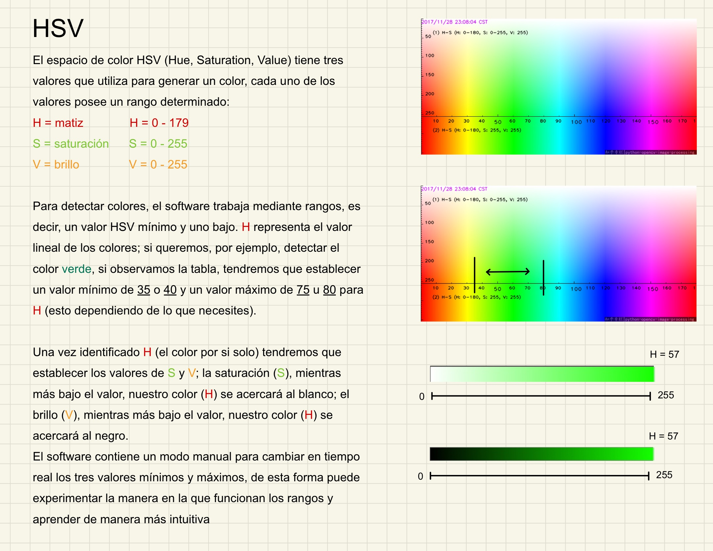

# Detección de colores con PyQt

Interfaz para la detección de distintos rangos de colores

## Requirements:

* imutils==0.5.4
* numpy==1.25.2
* opencv-python==4.8.0.76
* PyQt5==5.15.9
* PyQt5-Qt5==5.15.2
* PyQt5-sip==12.12.2

## Ambiente virtual

### VENV

Para poder correr el programa deberá crear un ambiente virtual dentro de la carpeta del proyecto con el comando siguiente:

```Shell
python -m venv venv
```

> El comando `python` puede variar si usted usa `python3`, éste depende de actualizar la forma de hacer ambientes vituales, corra: `sudo apt-get install python3-venv` en su linux para poder usar el comando de arriba con `python3`

Después habrá que iniciar el ambiente virtual; la manera de iniciar el ambiente depende de si usas unix o windows.

Unix:

```Shell
source venv/bin/activate
```

Windows:

```Shell
.\venv\Scripts\activate
```

> Si usa una terminal WSL o gitbash en windows las carpetas generadas seguirá siendo: `venv/Scripts/activate`, solo que deberá usar `source venv/Scripts/activate` para activar el ambiente.

Una vez iniciado el ambiente virtual, debería salirte en la terminal: (venv), arriba o atrás de la ruta de usuario; para instalar las librerías ejecute lo siguiente:

```Shell
pip install -r requirements.txt
```

Una vez instaladas las librerías, podrá iniciar la aplicación corriendo el archivo main.py del repositorio.

```Shell
python main.py
```
### Anaconda

Si su ambiente virtual se encuentra en anaconda, le recomendamos intalar las dependencias de la siguiente manera:

```Shell
conda install -c conda-forge imutils
```

```Shell
conda install -c conda-forge spyder
```
Spyder contiene todo lo relacionado con OpenCV y PyQt

> Si le aparece un error en las importaciones de los módulos de PyQt desde el vs code, instale pyqt-tools en su ambiente virtual: `pip install pyqt5-tools`

## Estructura

### /images

images contiene una imagen guía acerca de los rangos de colores HSV.



Esta imagen se puede visualizar en el programa en la pestaña de *ayuda*.

### /styles

Styles contiene un archivo main.css que define todos los estilos del interfaz. Éste se importa en la línea 234 del archivo main de la siguiente manera:

```Python
app = QApplication([])
app.setStyleSheet(open("./styles/main.css", "r").read())
```

### /views

[views](https://github.com/AlbertoNM/color_detection_PyQt/tree/main/views) contendrá nuestras variables globales, herramientas e importaciones que harán que la interfaz funcione, en esta carpeta podrá encontrar los métodos, funciones y variables que se utilizan en los algoritmos.

[Documentación de views](https://github.com/AlbertoNM/color_detection_PyQt/tree/main/views)

### main.py

main.py hereda la interfaz del archivo **window_ui.py**, por lo que main.py contiene todas las funcionalidades del interfaz, mientras que **window_ui.py** contiene los widgets.

La variable que hereda la interfaz es `ui`, por lo que un widget sería: `ui.widget`

### Archivos .ui

Estos archivos crean, por medio de un script, arcivhos de extensión .py que puedes utilizar para heredar los widgets, los archivos .ui son archivos xml que pueden ser editados en el software de [Qt designer](https://doc.qt.io/qt-6/qtdesigner-manual.html). Se recomienda estudiar la extensión de [PYQT Integratios](https://marketplace.visualstudio.com/items?itemName=zhoufeng.pyqt-integration) para darle un uso eficiente a Qt designer dentro de vs code.

### otros

Los demás archivos son para ordenar y definir el espacio de trabajo, se recomienda no editarlos
